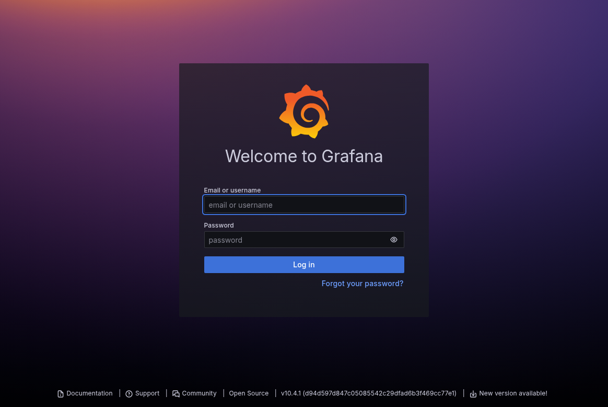
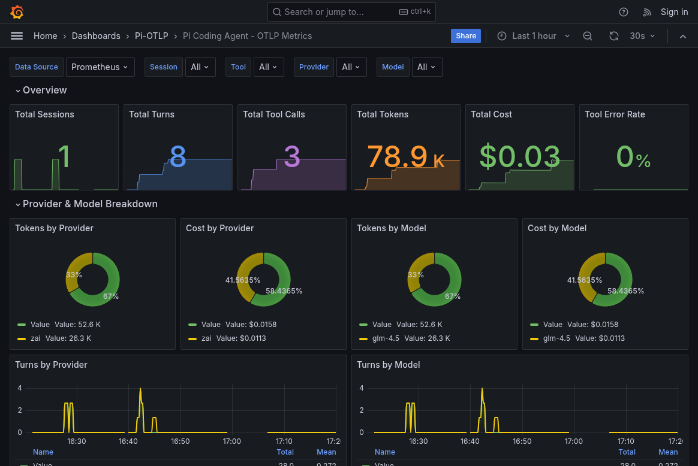

# Pi-OTLP Demo

Complete Docker-based demo environment for pi-otlp telemetry visualization.

## Architecture

```
┌─────────────────┐     ┌─────────────────┐     ┌─────────────────┐
│   Pi Coding     │────▶│     OTLP        │────▶│   Prometheus    │
│   Agent         │     │   Collector     │     │                 │
│   (local)       │     │   :4318         │     │   :9090         │
└─────────────────┘     └─────────────────┘     └────────┬────────┘
                                                         │
                                                         ▼
                                                ┌─────────────────┐
                                                │    Grafana      │
                                                │    :3000        │
                                                └─────────────────┘
```

## Screenshots

### Grafana Login


### Dashboard Overview


The dashboard displays:
- **Overview** - Total sessions, turns, tool calls, tokens, cost, and error rate
- **Provider & Model Breakdown** - Token and cost distribution by provider (e.g., anthropic, openai, zai) and model (e.g., claude-3, gpt-4, glm-4.5)
- **Session & Turn Activity** - Real-time activity rates and turns by session
- **Token Usage** - Token consumption over time with input/output/cache breakdown
- **Cost Analytics** - Cost tracking over time with per-turn and per-session averages
- **Tool Performance** - Tool call distribution, success/failure rates, and duration metrics
- **Duration Histograms** - Session, turn, and tool duration percentiles (p50, p95, p99)

## Quick Start

```bash
# Start the stack
cd demo
docker-compose up -d

# View logs
docker-compose logs -f

# Stop the stack
docker-compose down
```

## Access Points

| Service | URL | Credentials |
|---------|-----|-------------|
| Grafana | http://localhost:3000 | admin / admin |
| Prometheus | http://localhost:9090 | - |
| OTLP HTTP | http://localhost:4318 | - |
| OTLP gRPC | localhost:4317 | - |

## Configure Pi Agent

Run pi with OTLP telemetry enabled:

```bash
export PI_OTLP_ENABLE=1
export OTEL_METRICS_EXPORTER=otlp
export OTEL_EXPORTER_OTLP_ENDPOINT=http://localhost:4318/v1/metrics

pi
```

Or as a one-liner:

```bash
PI_OTLP_ENABLE=1 OTEL_METRICS_EXPORTER=otlp OTEL_EXPORTER_OTLP_ENDPOINT=http://localhost:4318/v1/metrics pi
```

## Verify Setup

1. **Check OTLP Collector is receiving metrics:**
   ```bash
   docker-compose logs otel-collector | grep -i metric
   ```

2. **Check Prometheus has metrics:**
   Open http://localhost:9090 and query `pi_session_count_total`

3. **View Grafana Dashboard:**
   Open http://localhost:3000 > Dashboards > Pi-OTLP > Pi Coding Agent - OTLP Metrics

## Troubleshooting

### No metrics in Prometheus

1. Verify OTLP collector is running:
   ```bash
   docker-compose ps
   curl http://localhost:4318/v1/metrics
   ```

2. Check pi agent has extension loaded:
   ```bash
   # In pi, run /info and look for pi-otlp in Extensions
   ```

3. Verify environment variables:
   ```bash
   echo $PI_OTLP_ENABLE        # Should be "1"
   echo $OTEL_METRICS_EXPORTER # Should be "otlp"
   ```

### Grafana dashboard shows no data

1. Check Prometheus datasource in Grafana settings
2. Verify time range includes when pi was running
3. Check Prometheus has any `pi_*` metrics:
   ```bash
   curl -s 'http://localhost:9090/api/v1/label/__name__/values' | grep pi_
   ```

### Port conflicts

Edit `docker-compose.yml` to change ports:
- Grafana: Change `3000:3000` to `3001:3000`
- Prometheus: Change `9090:9090` to `9091:9090`
- OTLP: Change `4318:4318` to `4319:4318`

Remember to update `OTEL_EXPORTER_OTLP_ENDPOINT` accordingly.

## Files

```
demo/
├── docker-compose.yml           # Container orchestration
├── otel-collector-config.yaml   # OTLP Collector config
├── prometheus.yml               # Prometheus scrape config
├── grafana/
│   ├── provisioning/
│   │   ├── datasources/         # Auto-configure Prometheus
│   │   └── dashboards/          # Auto-load dashboards
│   └── dashboards/
│       └── pi-otlp-dashboard.json
└── README.md
```

## Cleanup

```bash
# Stop and remove containers
docker-compose down

# Also remove volumes (data)
docker-compose down -v
```
